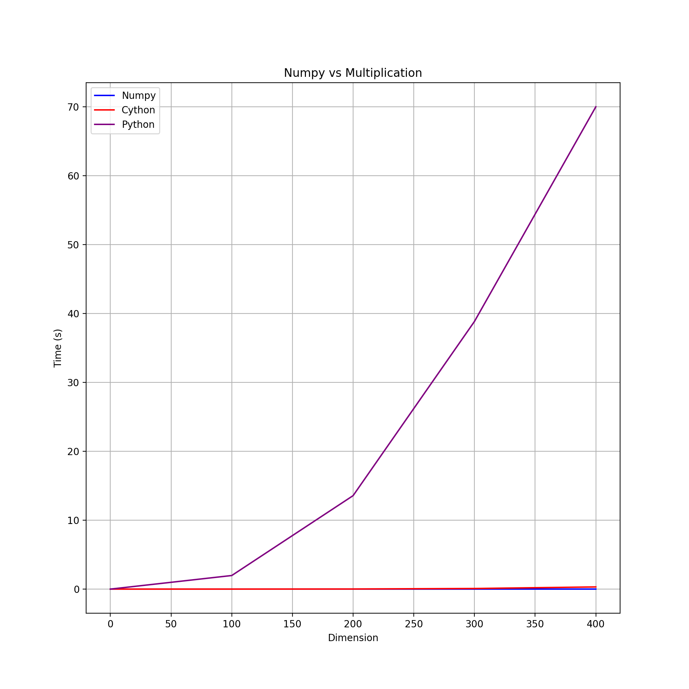

# Cython

Cython is an optimising static compiler for both Python and the extended Cython. It makes the syntax writing C extension as easy as Python itself. 

Cython combines the advantage of Python and C to let you interact efficiently with large data sets. As Cython drops down the code to the machine level, it speeds up the execution of Python code. 

The compiled extension of Cython involves three files:

`<addr>`Main file
`<addr>`The function to be compiled in .pyx file
`<addr>`A setup.py contains the instructions to make the extension module

# When to Use Cython

It worths noticing that Cython performs as nearly as good as Numpy. You may not choose to use Cython in a small dataset, but when working with a large dataset, it is worthy for your effort to use Cython to do our calculation quickly

